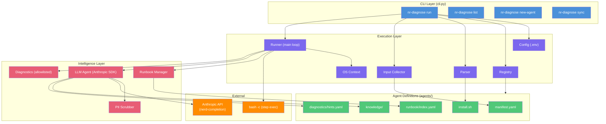
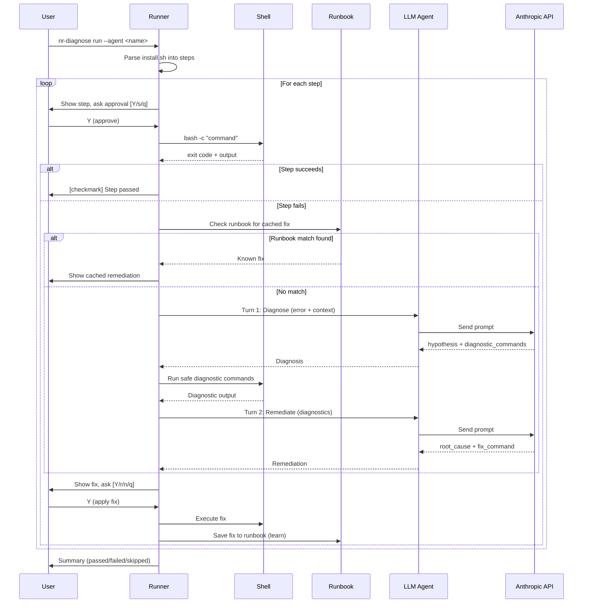

# nr-diagnose

AI-powered CLI that runs agent installation scripts step-by-step. When a step fails, it uses an LLM (Claude) to diagnose the failure and suggest a fix interactively.

## Architecture



### How It Works



## Quick Start

```bash
# 1. Clone and setup
git clone <repo-url>
cd ai-driven-installation
source setup.sh

# 2. Configure API key
cp .env.example .env
# Edit .env: set ANTHROPIC_API_KEY

# 3. Run
nr-diagnose run --agent otel-oracledbreceiver
nr-diagnose run --agent otel-oracledbreceiver --dry-run  # preview only
```

## Commands

| Command | Description |
|---------|-------------|
| `nr-diagnose run --agent <name>` | Run installation with AI diagnostics |
| `nr-diagnose run --agent <name> --dry-run` | Preview parsed steps without executing |
| `nr-diagnose list` | List available agents |
| `nr-diagnose new-agent <name>` | Scaffold a new agent definition |
| `nr-diagnose sync` | Share learned fixes back to the repo |

## Docker (with Oracle test environment)

```bash
docker compose -f docker-compose.test.yml build nr-diagnose
docker compose -f docker-compose.test.yml up -d oracle
docker compose -f docker-compose.test.yml run --rm nr-diagnose run --agent otel-oracledbreceiver
```

## Agent Structure

```
agents/<name>/
├── manifest.yaml              # Metadata (name, ports, services, inputs)
├── install.sh                 # Installation script (parsed into steps)
├── knowledge/
│   ├── prerequisites.md       # Preconditions for AI context
│   ├── common-failures.md     # Known failure modes (AI cheat sheet)
│   └── references.md          # Official docs and guides
├── diagnostics/
│   └── hints.yaml             # Priority diagnostic commands
└── runbook/
    └── index.yaml             # Cached pattern -> fix mappings
```

## Safety

- Diagnostic commands are allowlisted (no sudo, no destructive ops)
- PII/secrets scrubbed before sending to LLM
- Destructive remediations flagged with warning
- Human-in-the-loop: never auto-executes fixes
